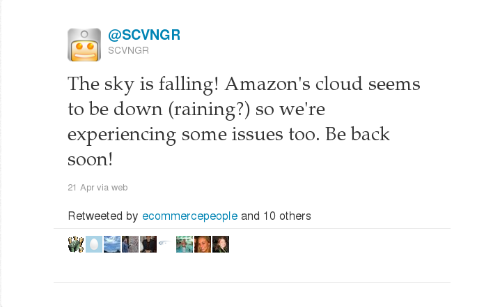
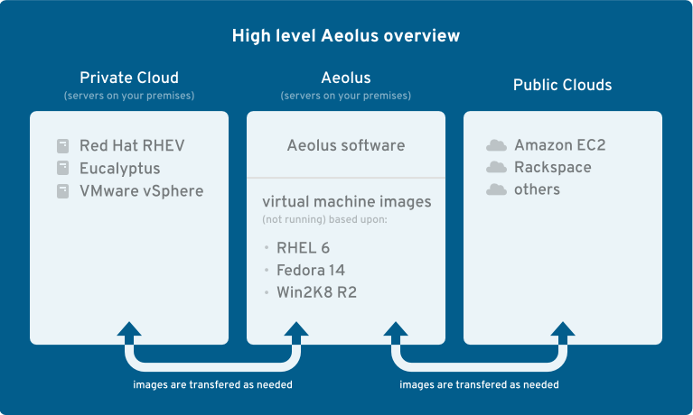
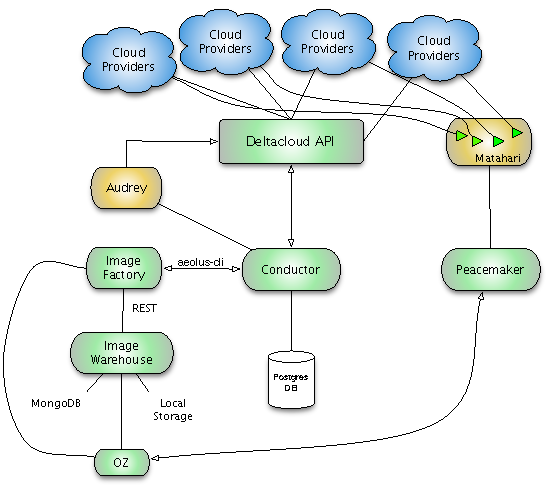

!SLIDE center
#  Cloud in the wild #

with Deltacloud API and Aeolus

!SLIDE bullets incremental
# @mfojtik && @fvollero #

* <strong style="color:#DA0006">Ruby</strong> lovers
* Open Source minded
* Open Standards evangelists

!SLIDE bullets incremental
# Cloud APIs #

* ... utilize on-demand premise
* ... automatize deployment
* ... build self-managed systems

!SLIDE center
# API categories

!SLIDE center
## Blind APIs ##
don't tell you their restrictions

!SLIDE center
## Closed APIs ##
disallow open-source implementations

!SLIDE center
## Open APIs ##
do whatever you want as long as you give attribution

!SLIDE center
# What else is open? #

!SLIDE center
# API protocol #

HTTP (REST), SOAP, XML-RPC, JSON-RPC...

!SLIDE center
# API libraries #

fog, cloudfiles, cloudservers, aws,...

!SLIDE center transition=fade
# However... #

!SLIDE bullets incremental
# Vendor lock-in #

* Each provider designed own API specification 
* Switching between providers is much harder
* Remember Oracle/SAP/Windows?

!SLIDE bullets incremental

# Deltacloud API #

* Open Source cross-cloud API
* <a href="http://deltacloud.apache.org">deltacloud.apache.org</a>
* <a href="http://api.deltacloud.org">https://api.deltacloud.org</a>

!SLIDE center

!SLIDE bullets incremental small

# Why another API? #

* Makes provider-to-provider migration easy
* Open license (<strong>ASL</strong>), development and design
* Rock solid <strong>ABI</strong> (drivers)
* <strong>REST</strong> based thus programming language agnostic

!SLIDE bullets incremental
# Architecture #

* HATEOAS, thus easy discoverable
* Multiple media types supported (XML, JSON, HTML)
* Programmed in Ruby (not Rails!)
* Easy to develop new drivers

!SLIDE bullets incremental
# Abstraction layer #

* Realm
* Hardware profile
* Image
* =
* <strong>Instance</strong>

!SLIDE commandline small

    $ irb
    >
    > client = DeltaCloud.new('user', 'password', 'http://localhost:3001/api') 
    >
    > client.create_instance('img1', :hardware_profile => 'm1-small')
    >
    > client.instances.last.stop!

!SLIDE bullets incremental
# Extended collections #

* Firewalls
* Keys
* Storage Volumes
* Buckets

!SLIDE bullets incremental
# Provider support #

* Computing
* Amazon EC2, Rackspace CloudServers, GoGrid, Terremark VCloud, Rimuhosting, VMWare VSphere, RHEV-M, IBM SBC, Eucalyptus, OpenNebula, OpenStack, Mock
* Storage
* Amazon S3, Rackspace CloudFiles, Azure Storage, Google Storage

!SLIDE commandline small

    $ irb
    >
    > client = DeltaCloud.new('user', 'password', 'http://localhost:3001/api') 
    >
    > client.with_config(:driver => :rackspace) do |rack|
    >   instance = rack.create_instance('img1')
    >   instance.destroy!
    > end
    >
    > client.with_config(:driver => :ec2) do |ec2|
    >   instance = ec2.create_instance('ami-1234')
    >   instance.destroy!
    > end

!SLIDE bullets incremental
# Similar projects #

* fog library (http://fog.io)
* OpenStack API (http://wiki.openstack.org/OpenStackAPI_1-1)

!SLIDE bullets incremental
# 'Native' providers #

* http://www.virtualmaster.cz/en/
* Your company [here] :-)

!SLIDE bullets
# Future #

* More drivers!
* CIMI standard
* Aeolus project!

!SLIDE bullets
# We &hearts; cloud #

* Cheap
* Unlimited bandwidth throughput
* Easy to deploy large app

!SLIDE center
# This...can happen #

!SLIDE center
## and this is the result ##

!SLIDE center

# <b>Aeolus Project</b>
Manage Your Cloud Deployments with Ease

!SLIDE bullets
# <b> Aeolus Project </b>#
* Released under ASL 2.0
* Support for multiple public/private cloud options
* Ability to create equivalent images across multiple cloud providers
* Ability to manage lifecycle/monitor instances across multiple clouds at the same time (cuts dependency on a single provider)

!SLIDE center
## Aeolus Project - Top view

!SLIDE center
# Aeolus && Subprojects

!SLIDE center
# <b>Q</b> & <b>A</b> #

!SLIDE center
# <b> Thanks for the attention</b>
@mfojtik && @fvollero
